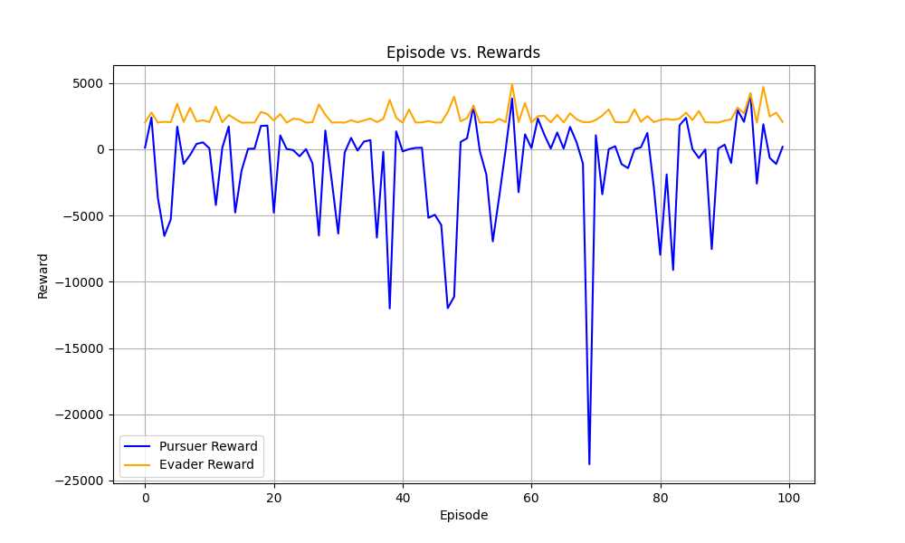

## Pursuit Evasion Game

A multi-agent pursuit and evasion game where the evader will learn to effectively avoid from the pursuer, while pursuer will learn to catch the evader progressively using reinforcement learning algorithms.

## Environment Setup
An application which consists of a game arena that is the environment, few agents (just five evader and one pursuer for now, but the number can be easily increased).
Pursuer and evaders have different set of policies on basis of which they are rewarded. The reward is a numerical value. For pursuer, following are some example policies which decide his reward:
1) How much area has covered till now?
2) How close to the evaders?
3) Is colliding with the wall?
4) Has caught the evader? i.e. Is the evader in purser’s vision radius?

For evaders, following are some example policies/ cases which decide his reward:
1) How much area has covered till now?
2) How close to the purser?
3) Is colliding with the wall?
4) Is avoiding successfully? i.e. Is away from the pursuer’s vision radius?

On basis these policies, the agent is granted a positive reward(incentive) is a negative reward(penalty), according to his present state in the environment.

Q-learning reinforcement learning algorithm is used, which seeks to find the best action to take given the current state. New actions can be explored or a old action can be reused (exploration/ exploitation), which is decided by the Q-Learning algorithm at run-time.

Coming to the flexibility of movement, agent can move a single unit right/left/up/down and rotate by an angle in a single action. In exploration, every action that the agent performs is selected randomly. After random selection of an action, the action is validated. Checks are made to ensure that action is within the arena and the agents doesn’t overlap the walls. Wall collisions are taken care of. If everything is in place, then the action is performed and additions are made to the Q-Table.

A dashboard is added, in which current state of environment, rewards of the agents and selected agent’s vision to be displayed can be selected.

## Directory Structure

```
├── colors.py              # For color codes
├── creating_qtable.py     # For creating Q-tables
├── depick.py              # For de pickling of Q-tables
├── evader.py              # For eavders movement and policy
├── level.py               # For creating walls blocks
├── player.py              # For common movement of both pursuer and eavder
├── plot.py                # For ploting episodes vs rewards
├── pursuer.py             # For pusuer movement and policy
├── policy.py              # Contains Q learning policy
├── raycast.py             # For incluidng ray casting
├── train.py               # For train the agents
├── test.py                # For testing the environment
├── vision.py              # For define vision range
├── walls.py               # For defining walls

```

## Visualization

1. **Rewards Over 100 Episodes**


1. **Rewards Over 1000 Episodes**


